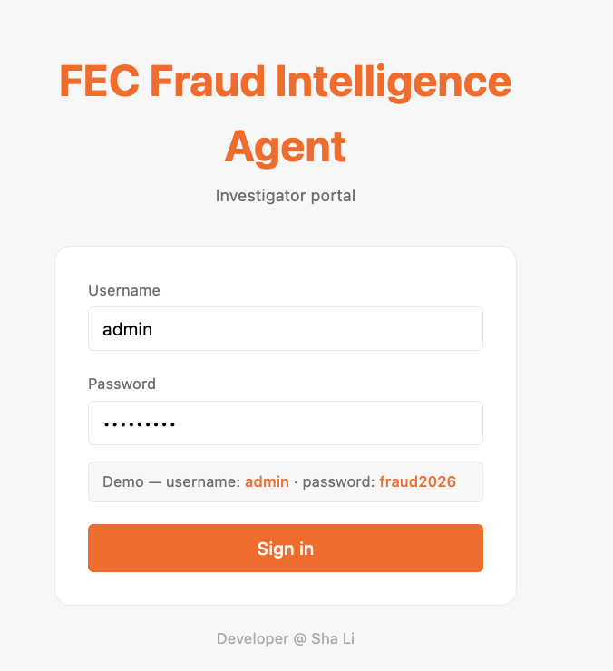
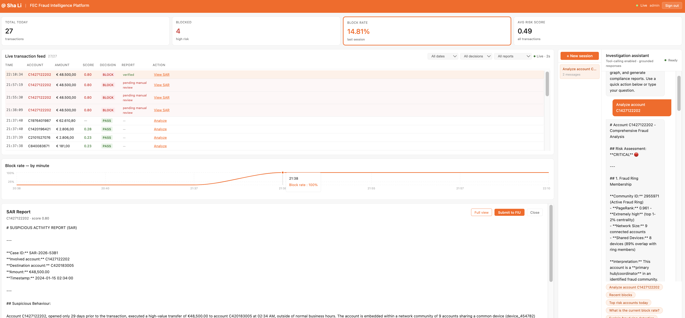
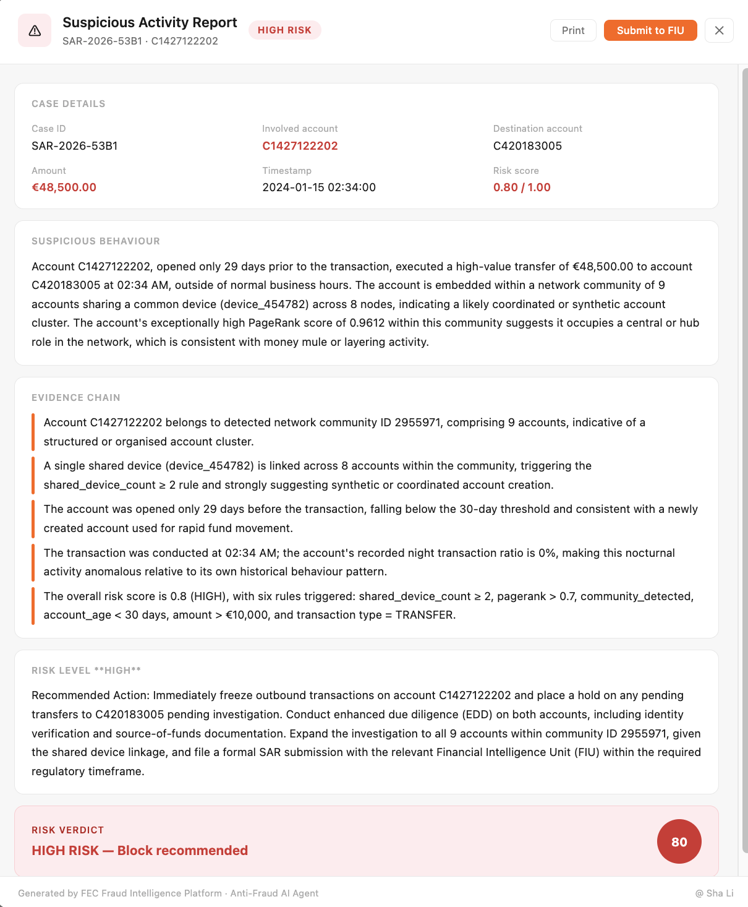

# Anti-Fraud AI Agent

Production-oriented fraud investigation platform for bank FEC teams. Combines PySpark, Neo4j graph analytics, LangGraph agent, and Claude LLM to automate transaction screening and SAR report generation.

**Sha Li · AI Engineer · Netherlands**

---

## Screenshots

---

## Tech stack

- **Data** — PySpark · Neo4j (Louvain + PageRank) · Redis Streams · PostgreSQL
- **Backend** — FastAPI · LangGraph · Claude Haiku + Sonnet · Pydantic v2
- **Frontend** — React · TypeScript · Vite · Recharts
- **Infrastructure** — Docker Compose

---

## Key features

- Deterministic rules engine pre-filters 90%+ of transactions before any LLM call
- LangGraph 4-node agent: graph query → risk profile → scoring → SAR generation
- Neo4j fraud ring detection with Louvain community detection and PageRank
- SAR reports with post-generation grounding verification
- Real-time investigation chat with SSE streaming and session memory

---

## Live Demo

Coming soon.

---

